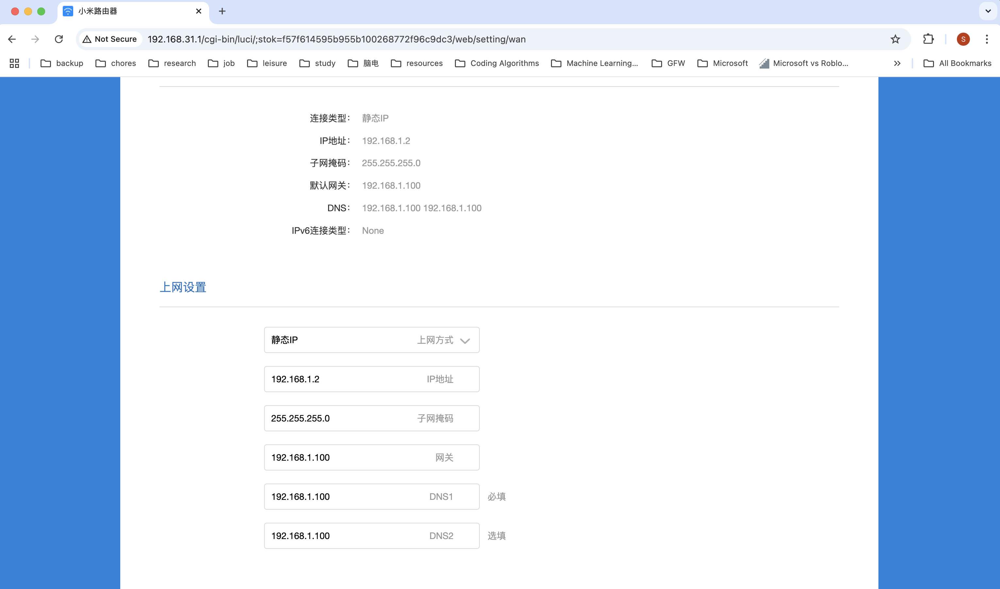
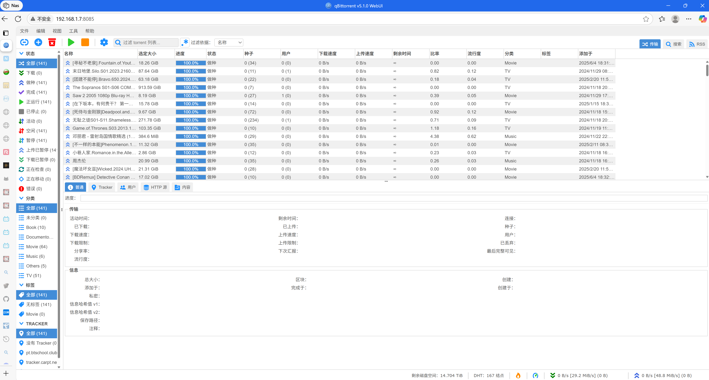

# 完整版家庭影院打造 (Nas + 软路由 + Apple TV)

Nas可以充当家庭里面的计算资源、网路软路由、硬盘存储等等。一台稳定强大的Nas基本可以满足所有进阶的个人影音（甚至个人计算服务）需求。
但是从另外一个角度来说，Nas也需要更多的专业知识来设置和维护。现把搭建Nas的经验和踩过的坑尽量记录如下。

家庭网络结构如下:

其中,NAS以及NAS的虚拟机，都是使用固定IP而不是DHCP。但是因为Nas轻易不会关机重启，所以使用固定IP也问题不大。

## 部件选择

- **NAS**。预算够直接上白群晖，DS-920+或者DS-923+都可以，看预算。推荐小白一上来就组黑群晖，预算够的话也不太推荐内地的极空间等国产品牌。相对而言，，台湾的Nas行业起步早，质量好，软件生态方面更是碾压。两个台湾品牌群晖和威联通都不错，但是威联通的学习成本相对更高，最终推荐还是群晖。
- **Apple TV**。 Apple TV的话，最新的是第七代，也就是2022年推出的Apple TV 4K（第三代）。然而实际上第七代和第六代的效果基本没啥大区别，所以买第六代第七代都行，看个人预算。而且这种设备完全也不需要买全新，直接去咸鱼上买九成以上新的二手就行，只要勾上筛选条件“卖家信誉极好”，基本上不会踩坑。预估成本￥800-1200。
- **梯子**。 直接上Just My Socks LA 1000套餐（[相关阅读](https://ijustmysocks.com/375.html), [购买链接](https://justmysocks6.net/members/cart.php?a=confproduct&i=1)）。成本每个月10刀，1T流量不限设备。
- **旁路由**。在NAS上建一台虚拟机用OpenWrt系统当软路由，然后用一台普通的无线路由器指向这个虚拟机的ip，这样所有需要翻墙的设备只要连接这台无线路由器就可以自动翻墙了。

## 搭建步骤

1. 设置安装群晖Nas。白群晖非常省心，可以参考任意教程，比如[CSDN](https://blog.csdn.net/pzzhouziao/article/details/122353548)。但是值得注意的是，我们不需要在这一步配置数据上传与下载，因为我们并不会使用自带的File Station来进行上传和下载，而是会使用qBittorrent工具。
2. 在群晖上安装Virtual Machine Manager。直接在套件中心里搜索安装即可，很省心。
3. 新建一台虚拟机来搭建OpenWrt系统。使用关键字“群晖nas虚拟机安装openwrt教程” 来搜索相关教程，可以参考但是不限于这些：
    - [Zhihu](https://zhuanlan.zhihu.com/p/539942701)
    - [SMZDM](https://post.smzdm.com/p/arr3k3o7/)
    - [Bilibili](https://www.bilibili.com/opus/871670076655271942)
需要记住这里OpenWrt虚拟机的ip应该是固定的，这样后面的无线路由器才能指向这个ip，例子里用的是192.168.1.100。
4. 购买梯子。买好就可以拿到梯子的订阅链接，注意这个链接是订阅链接。还需要转成clash客户端能识别的clash链接，可以用[ACL4SSR](https://acl4ssr-sub.github.io/)这一工具。相关阅读：[什么是Clash?](https://clash.wiki/)；[傻瓜式教程《如何使用Clash翻墙》](https://github.com/Sha1rholder/Clash-against-GFW)。这一步做完之后，拿到了clash链接，会用在之后的OpenClash插件配置上。
5. 在OpenWrt上安装OpenClash插件。同样可以搜OpenWrt安装OpenClash关键字，然后跟着视频或者文字教程做。比如这个：[Youtube tutorial](https://www.youtube.com/watch?v=zEw-ig9kprc)。
6. 在OpenClash上配置。这一步要用到之前准备好的clash链接，基本配置包括流量规则和代理地址，更高级的配置可以暂时不用管，等有更多知识储备以后再尝试。具体可以搜OpenClash配置来找到视频和文字教程。比如[OpenClash官网](https://openclash.net/)。到这一步，如果一切正常的话，那么在OpenClash上测试能否访问Youtube等外网网站应该是通过的，如下所示：
7. 使无线路由器指向之前的OpenWrt虚拟机地址，（我用的路由器是小米，所以默认ip地址是192.168.31.1）。如图所示。
8. 此时所有的192.168.1.*的网段应该可以正常访问国内网络，192.168.31.*的网段可以正常访问墙外网络。
9. Apple TV - 此时Apple TV已经可以正常翻墙上网，需要进行配置。走完简单的流程后即可正常使用基本功能比如里面的流媒体：[激活流程视频](https://www.youtube.com/watch?v=f6jwFyqbMy8)。此时只剩下最后一步，购买流媒体账号。以Netflix为例，直接去京东上搜奈飞会员，选个评价高的店铺买，基本上都是十几块到二十几块人民币一个月。它的本质是一个家庭总账号里有五个家庭成员账号，咱们花钱买的只是其中一个成员账号的位置。卖家通过去便宜的区（比如阿根廷）注册购买奈飞总账号，再分卖车位给顾客来赚差价。所以购买的时候跟买家说清楚，你买的槽位（比如第二个）是你独享的，然后买到账号以后登进去，第一时间设置账户的pin码，改账号头像和名字。这样防止卖家重复买相同槽位给别人，也防止不懂事的买家错用了你的位置。毕竟自己的观看记录被动了还是很不舒服的体验。（除了购买奈飞，Disney+，HBO等等官方流媒体服务外，其实国内有很多自己搭建的个人流媒体服务。因为这种自建的流媒体服务价格实在太低了，所以也可以考虑购买。具体操作是直接上咸鱼搜apple tv流媒体，就可以搜出来一堆，买了以后可以用Apple TV上的Emby或是Infuse来连接流媒体服务器，从而实现高速观影。）
10. XBox - 把无线网络设置成已翻墙的无线网即可。
11. PT(Private Tracker)配置 - 使用qBittorrent作为PT下载的主力。安装qBittorrent有很多选项，比如用Container Manager把它装到docker container里（需要翻墙，下图一所示）或者用VM manager把它装到虚拟机里，但是最推荐的还是使用群晖自己的套件中心来安装它，简单好用，如下图二所示。具体教程可以搜索"群晖安装qBittorrent套件"，比如[这个教程](https://zuiyu1818.cn/posts/NAS_qBittorrent). 
配置好以后，可以通过访问qBittorrent的页面（本例配置为192.168.1.7:8085）来进行管理和使用，如下图。
12. PT会员 - 配置好qBittorrent以后，你需要成为某个PT网站的会员才能在上面进行种子的下载。PT网站大部分都是邀请制，所以需要你去找有能力邀请你的朋友来帮忙邀请注册。成为会员以后，下载的步骤是PT网站上下载种子，下载好种子之后上传到qBittorrent UI上，上传完成之后会自动开始下载，如下图所示。

## 后话

家庭影音部分，还有很多别的玩法，比如搭建RSS Hub来优雅获取RSS内容。以及搭建自动追剧系统等等，比如这个[GitHub automatic-theater](https://github.com/LuckyPuppy514/automatic-theater)。有很多高级玩法可以探索。

除去家庭影音的部分外，Nas还有很多高阶用法，比如搭建个人网页服务器，提供公网访问，搭建照片和视频备份，等等。这些我基本都自己体验过，这里暂时不加上，有需要再更新上来。

Happy hacking and keep trying!
