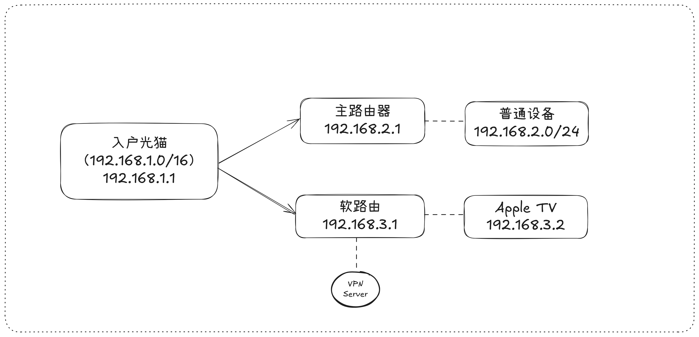

# 简化版个人家庭影院打造 (No NAS, No VPS)
其实只要对个人存储空间没有执念，流媒体就足够满足个人家庭影音需求了，所以NAS这个设备在这个方案种被首先简化掉了。
接下来唯一要解决的就是网络问题，这里采用了简化的版本，直接买梯子而不是自己买VPS搭梯子。取舍的原因是目前服务商里稳定性较好且适合影音流量的是搬瓦工，自己买搬瓦工vps搭建的话大约成本是每个月5刀，买现成梯子的成本是每个月10刀，而且可以防止ip锁，灵活切换地区线路。
最终家庭网络结构大致如下:

## 部件选择
- **Apple TV**。 Apple TV的话，最新的是第七代，也就是2022年推出的Apple TV 4K（第三代）。然而实际上第七代和第六代的效果基本没啥大区别，所以买第六代第七代都行，看个人预算。而且这种设备完全也不需要买全新，直接去咸鱼上买九成以上新的二手就行，只要勾上筛选条件“卖家信誉极好”，基本上不会踩坑。预估成本￥800-1200。 
- **梯子**。 直接上Just My Socks LA 1000套餐（[相关阅读](https://ijustmysocks.com/375.html), [购买链接](https://justmysocks6.net/members/cart.php?a=confproduct&i=1)）。成本每个月10刀，1T流量不限设备。
- **旁路由**。我自己的旁路由是在NAS上建了一台虚拟机用OpenWrt系统当软路由，如果方案中不涉及NAS的话，也可以买一台实体路由当旁路由。比较主流的做法是把旁路由刷机刷成OpenWrt系统，然后再在上面安装OpenClash。（[2023支持刷机(OpenWrt)的路由器大全](https://blog.csdn.net/dxt1107/article/details/131477135)，[2024支持刷机的路由器大全](https://zhuanlan.zhihu.com/p/692460408)).
还有一条可能更简单的道路，是直接买iKua路由器，然后直接用它原生的软件来搭建VPN服务。这条路我没有走过，但是网上有很多教程，可以搜一搜然后一步步跟着做即可。(e.g. https://www.youtube.com/watch?v=rBhB8GlAdLg)

## 搭建步骤
本方案其实步骤极为简单，主要集中在搞定网络。
1. 购买梯子。买好就可以拿到梯子的订阅链接，注意这个链接是订阅链接。还需要转成clash客户端能识别的clash链接，可以用[ACL4SSR](https://acl4ssr-sub.github.io/)这一工具。相关阅读：[什么是Clash?](https://clash.wiki/)；[傻瓜式教程《如何使用Clash翻墙》](https://github.com/Sha1rholder/Clash-against-GFW)。这一步做完之后，拿到了clash链接，会用在之后的OpenClash插件配置上。
2. 搭建OpenWrt系统。可以上b站搜索路由器刷OpenWrt这一关键字，然后跟着视频一步步做。比如这个: https://www.bilibili.com/video/BV1pz411v7By/。
3. 在OpenWrt上安装OpenClash插件。同样可以搜OpenWrt安装OpenClash关键字，然后跟着视频或者文字教程做。比如这个：https://www.youtube.com/watch?v=zEw-ig9kprc。
4. 在OpenClash上配置。这一步要用到之前准备好的clash链接，基本配置包括流量规则和代理地址，更高级的配置可以暂时不用管，等有更多知识储备以后再尝试。具体可以搜OpenClash配置来找到视频和文字教程。比如这个：https://openclash.net/。
5. 此时Apple TV已经可以正常翻墙上网，需要进行配置。走完简单的流程后即可正常使用基本功能比如里面的流媒体：[激活流程视频](https://www.youtube.com/watch?v=f6jwFyqbMy8)。此时只剩下最后一步，购买流媒体账号。以Netflix为例，直接去京东上搜奈飞会员，选个评价高的店铺买，基本上都是十几块到二十几块人民币一个月。它的本质是一个家庭总账号里有五个家庭成员账号，咱们花钱买的只是其中一个成员账号的位置。卖家通过去便宜的区（比如阿根廷）注册购买奈飞总账号，再分卖车位给顾客来赚差价。所以购买的时候跟买家说清楚，你买的槽位（比如第二个）是你独享的，然后买到账号以后登进去，第一时间设置账户的pin码，改账号头像和名字。这样防止卖家重复买相同槽位给别人，也防止不懂事的买家错用了你的位置。毕竟自己的观看记录被动了还是很不舒服的体验。（除了购买奈飞，Disney+，HBO等等官方流媒体服务外，其实国内有很多自己搭建的个人流媒体服务。因为这种自建的流媒体服务价格实在太低了，所以也可以考虑购买。具体操作是直接上咸鱼搜apple tv流媒体，就可以搜出来一堆，买了以后可以用Apple TV上的Emby或是Infuse来连接流媒体服务器，从而实现高速观影。）

## 后话
去掉Nas以后，搭建技术成本降低了很多，但是也少掉了本地高速存储网络的绝大部分优势,比如Apple TV上可以用infuse pro来高速访问本地NAS设备里的超高清影剧集。NAS还可以成为手机照片视频的备份服务器，提供24小时在线的PT(private tracker)上传下载，搭建个人文件服务器，个人网站服务器，等等等等。
***但是***，好处归好处，Nas是一个金钱和精力的无底深坑，衷心建议小白慎重入坑:mask::mask::mask:
